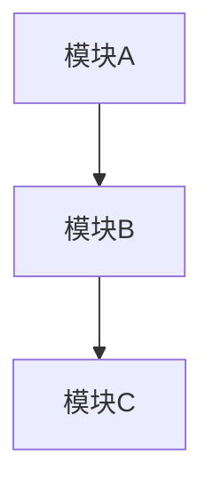
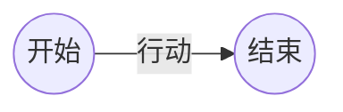
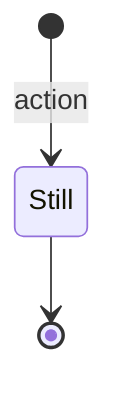

# [项目名称] AI Agent指南

> 最后更新: [YYYY-MM-DD]  
> 分析进度: [初始化 | 探索中 | 基本完成 | 持续维护]


## 项目概述

[一句话描述项目的核心业务价值]

| 属性             | 值                |
| ---------------- | ----------------- |
| 项目名称         |                   |
| 业务领域         |                   |
| 技术栈摘要       |                   |
| 代码规模         | ~X 文件 / ~Y KLOC |
| 核心模块数       |                   |
| 启动年份（推测） | 基于[依据]        |


## 快速导航

- 核心入口: `src/main/...`
- 配置文件: `config/...`
- 业务文档: `docs/`
- API定义: `docs/api/`


## 技术架构

### 技术栈

#### 后端
| 类别   | 技术 | 版本 | 备注 |
| ------ | ---- | ---- | ---- |
| 语言   |      |      |      |
| 框架   |      |      |      |
| ORM    |      |      |      |
| 数据库 |      |      |      |


#### 前端

| 类别     | 技术 | 版本 | 备注 |
| -------- | ---- | ---- | ---- |
| 框架     |      |      |      |
| 构建工具 |      |      |      |
| UI库     |      |      |      |


#### 基础设施

| 类别   | 技术 | 用途 |
| ------ | ---- | ---- |
| 构建   |      |      |
| 部署   |      |      |
| 中间件 |      |      |


### 模块结构

```markdown
project-root/
├── [模块1]/ # 职责描述
│   ├── ...
├── [模块2]/ # 职责描述
└── docs/ # 知识库文档
```


### 模块依赖




## 核心业务

### 功能模块清单

| 模块 | 路径 | 职责 | 核心类/文件 |
| ---- | ---- | ---- | ----------- |
|      |      |      |             |


### 关键业务流程

> 采用mermaid协议的流程图（参考BPMN2.0规范）、状态机

#### [流程名称1]



#### [流程名称2]


#### [状态流转]




### 领域术语表

| 术语 | 定义 | 代码中的表现 |
| ---- | ---- | ------------ |
|      |      |              |


### 核心实体模型

| 实体 | 表名 | 主要字段 | 关联关系 |
| ---- | ---- | -------- | -------- |
|      |      |          |          |


## 开发规范

> 从 ~/ai/rules/ 或 ~/.cursor/rules/ 或 ~/.claude/rules/ 提取 

### 需求规范


### 设计规范


### 代码规范


### 工程结构规范


### Git工作流

- 分支策略:
- 提交规范:


### 测试规范


## 约定与约束

### 关键约
- [ ] 约束1
- [ ] 约束2


### 文档同步规则

**自动更新触发条件:**
- 新增或修改 API 接口
- 数据模型变更
- 业务规则发现或变更
- 重大架构调整

**更新要求:**

- 更新 `AGENTS.md` 和`README.md` 相关内容和"最后更新"时间戳
- 同步更新 `docs/` 下相关文档
- 在"会话历史摘要"中记录变更


## 技术债务登记

| ID     | 描述 | 位置 | 优先级   | 建议方案 |
| ------ | ---- | ---- | -------- | -------- |
| TD-001 |      |      | P0/P1/P2 |          |


## 已知风险

| 风险 | 影响范围 | 规避建议 |
| ---- | -------- | -------- |
|      |          |          |


## 工作约定

### 会话开始时
1. 阅读本 `AGENTS.md` 和 `README.md` 了解项目全貌
2. 根据任务查阅 `docs/` 下相关文档
3. 确认当前工作上下文


### 会话进行中

- 遇到不明确的业务规则，记录到待确认清单
- 发现技术债务，登记到技术债务表
- 重大修改必须遵循 SDD（Spec-Driven Development）原则


### 会话结束时

- 提炼发现新的业务规则，提示确认后，更新到 `@docs/` 相应文件
- 提炼发现开发规范、约束，提升确认后，更新到 `@AGENTS.md` 
- 更新 AGENTS.md 的会话历史摘要
- 标注未完成事项


## 会话历史摘要

### [YYYY-MM-DD] - 初始化
- 创建知识库结构
- 识别技术栈: ...
- 识别核心模块: ...