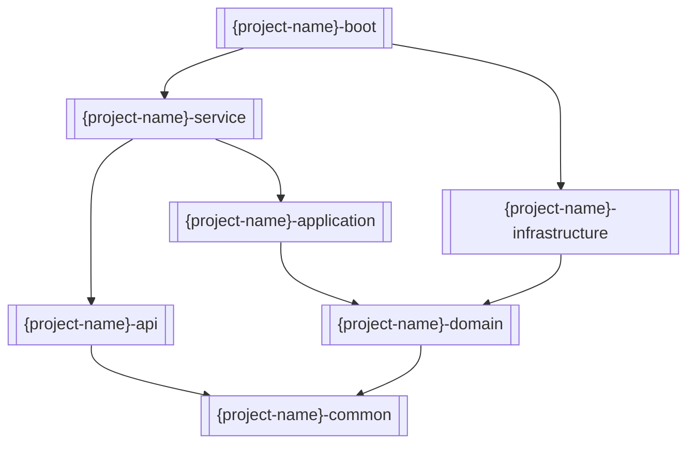

# 项目结构规范指南

> DDD六边形架构规范，详细定义各模块职责和代码组织

## 架构概述

### DDD六边形架构
```
{project-name}/                          # 根目录
├── {project-name}-api/                  # API接口层 (用户接口层)
├── {project-name}-service/              # 服务适配层 (用户接口层)
├── {project-name}-application/          # 应用服务层 (应用层)
├── {project-name}-domain/               # 领域服务层 (领域层)
├── {project-name}-infrastructure/       # 基础设施层 (基础设施层)
├── {project-name}-common/               # 共享模块
└── {project-name}-boot/                 # 应用启动模块
```

### 模块依赖关系


## 分层架构规范

### 1. 用户接口模块（api层）

#### 职责定位
- **对应领域分层**: 用户接口层的接口定义
- **核心职责**: 定义服务接口、公共常量、通用定义
- **边界**: 定义服务契约，不包含任何实现

#### 代码结构
```
{project-name}-api/
├── src/main/java/com/{company}/{business}/{businessdomain}/
│   └── {context}/api/
│       ├── request/     # 请求参数对象
│       ├── response/    # 响应结果对象
│       ├── dto/         # 数据传输对象
│       └── {Aggregate}Service.java  # RPC服务接口
└── pom.xml
```

#### 命名规范
- **服务接口**: `{Aggregate}Service`
- **请求对象**: `{Aggregate}{Action}Request`
- **响应对象**: `{Aggregate}{Action}Response`
- **DTO对象**: `{Aggregate}{Entity}DTO`
- **包路径**: `com.{company}.{business}.{businessdomain}.{context}.api`

#### 约束规则
- 禁止直接暴露领域对象
- 所有接口方法必须有完整的JavaDoc
- 使用`@Data`注解简化POJO
- 参数验证使用Bean Validation注解

### 2. 服务适配模块（service层）

#### 职责定位
- **对应领域分层**: 用户接口层的适配器实现
- **核心职责**: 输入输出转换、全局异常处理、状态码封装
- **边界**: 接收外部请求，转换为内部命令

#### 代码结构
```
{project-name}-service/
├── src/main/java/com/{company}/{business}/{businessdomain}/
│   └── {context}/
│       ├── provider/
│       │   ├── rpc/
│       │   │   └── {Aggregate}Provider.java  # RPC实现
│       │   └── web/
│       │       ├── controller/
│       │       │   └── {Aggregate}Controller.java  # HTTP控制器
│       │       └── filter/  # 过滤器
│       ├── mq/
│       │   ├── consumer/  # 消息消费者
│       │   └── listener/  # 事件监听器
│       ├── job/
│       │   ├── task/      # 定时任务
│       │   └── handler/   # 任务处理器
│       ├── factory/
│       │   └── {Aggregate}ProviderFactory.java  # 转换工厂
│       └── config/        # 配置类
└── pom.xml
```

#### 命名规范
- **实现类**: `{Aggregate}Provider` (RPC) / `{Aggregate}Controller` (HTTP)
- **工厂类**: `{Aggregate}ProviderFactory`
- **包路径**: `com.{company}.{business}.{businessdomain}.{context}`

#### 转换规范
- 使用MapStruct进行对象转换
- 转换逻辑统一放在Factory类中
- 输入: `Request` → `Command`
- 输出: `Result` → `Response`

### 3. 应用服务模块（application层）

#### 职责定位
- **对应领域分层**: 应用服务层
- **核心职责**: 用例编排、事务边界、流程控制
- **边界**: 协调领域对象完成业务用例

#### 代码结构
```
{project-name}-application/
├── src/main/java/com/{company}/{business}/{businessdomain}/
│   └── {context}/application/
│       ├── service/
│       │   └── {Aggregate}ApplicationService.java  # 应用服务
│       ├── action/           # 业务动作
│       ├── command/          # 命令对象
│       ├── query/            # 查询对象
│       ├── result/           # 结果对象
│       └── factory/
│           └── {Aggregate}CommandFactory.java  # 命令工厂
└── pom.xml
```

#### 命名规范
- **应用服务**: `{Aggregate}ApplicationService`
- **命令对象**: `{Aggregate}{Action}Command`
- **查询对象**: `{Aggregate}{Query}Query`
- **结果对象**: `{Aggregate}{Action}Result`
- **包路径**: `com.{company}.{business}.{businessdomain}.{context}.application`

#### 约束规则
- 应用服务只接收Command/Query对象
- 应用服务返回Result对象
- 使用事务注解控制事务边界
- 不直接操作领域对象的内部状态

### 4. 领域服务模块（domain层）

#### 职责定位
- **对应领域分层**: 领域服务层
- **核心职责**: 核心业务逻辑、领域模型、业务规则
- **边界**: 包含所有业务逻辑，不依赖任何技术细节

#### 代码结构
```
{project-name}-domain/
├── src/main/java/com/{company}/{business}/{businessdomain}/
│   └── {context}/domain/
│       ├── model/        # 领域模型
│       │   ├── {Aggregate}.java      # 聚合根
│       │   ├── {Entity}.java         # 实体
│       │   └── {ValueObject}.java    # 值对象
│       ├── service/      # 领域服务
│       │   └── {Aggregate}DomainService.java
│       ├── facade/       # 查询门面
│       │   └── {Aggregate}QueryFacade.java
│       ├── repository/   # 仓储接口
│       │   └── {Aggregate}Repository.java
│       ├── event/        # 领域事件
│       └── specification/ # 规格模式
└── pom.xml
```

#### 命名规范
- **聚合根**: `{Aggregate}`
- **实体**: `{Entity}`
- **值对象**: `{ValueObject}`
- **领域服务**: `{Aggregate}DomainService`
- **查询门面**: `{Aggregate}QueryFacade`
- **仓储接口**: `{Aggregate}Repository`
- **包路径**: `com.{company}.{business}.{businessdomain}.{context}.domain`

#### 领域模型规范
- **聚合根**: 管理聚合内所有对象的生命周期
- **实体**: 具有唯一标识的领域对象
- **值对象**: 无标识，通过属性值区分
- **领域服务**: 处理跨聚合的业务逻辑
- **仓储接口**: 定义聚合持久化契约

### 5. 基础设施模块（infrastructure层）

#### 职责定位
- **对应领域分层**: 基础设施层
- **核心职责**: 技术实现、持久化、外部系统集成
- **边界**: 实现领域层定义的所有技术接口

#### 代码结构
```
{project-name}-infrastructure/
├── src/main/java/com/{company}/{business}/{businessdomain}/
│   └── {context}/infrastructure/
│       ├── dao/          # 数据访问对象
│       │   └── {Aggregate}Dao.java
│       ├── entity/       # 持久化实体
│       │   └── {Aggregate}Entity.java
│       ├── mapper/       # MyBatis Mapper
│       │   └── {Aggregate}Mapper.java
│       ├── factory/      # 实体工厂
│       │   └── {Aggregate}EntityFactory.java
│       ├── config/       # 配置类
│       └── message/      # 消息处理
└── pom.xml
```

#### 命名规范
- **DAO实现**: `{Aggregate}Dao`
- **实体类**: `{Aggregate}Entity`
- **Mapper接口**: `{Aggregate}Mapper`
- **工厂类**: `{Aggregate}EntityFactory`
- **包路径**: `com.{company}.{business}.{businessdomain}.{context}.infrastructure`

#### 技术实现规范
- 使用MyBatis进行数据库访问
- 实体类使用JPA注解映射数据库表
- 工厂类使用MapStruct进行对象转换
- 事务控制使用Spring的`@Transactional`

### 6. 共享模块（common层）

#### 职责定位
- **共享组件**: 被多个模块依赖的通用代码
- **核心职责**: 常量定义、枚举类型、工具类、异常定义
- **边界**: 不包含业务逻辑，只提供通用能力

#### 代码结构
```
{project-name}-common/
├── src/main/java/com/{company}/{business}/{businessdomain}/common/
│   ├── consts/     # 常量定义
│   ├── enums/      # 枚举类型
│   ├── utils/      # 工具类
│   └── exception/  # 异常定义
└── pom.xml
```

#### 命名规范
- **常量类**: `{Business}Constants`
- **枚举类**: `{Business}Status` / `{Business}Type`
- **工具类**: `{Utility}Utils`
- **异常类**: `{Business}Exception`
- **包路径**: `com.{company}.{business}.{businessdomain}.common`

### 7. 应用启动模块（boot层）

#### 职责定位
- **应用启动**: Spring Boot应用的启动入口
- **配置管理**: 环境配置、启动参数
- **边界**: 只负责启动应用，不包含业务逻辑

#### 代码结构
```
{project-name}-boot/
├── src/main/java/com/{company}/{business}/{businessdomain}/
│   └── boot/
│       └── Application.java  # 启动类
├── src/main/resources/
│   ├── application.yml       # 主配置文件
│   ├── application-dev.yml   # 开发环境配置
│   ├── application-prod.yml  # 生产环境配置
│   └── application-test.yml  # 测试环境配置
└── pom.xml
```

#### 命名规范
- **启动类**: `Application`
- **包路径**: `com.{company}.{business}.{businessdomain}.boot`

## 包结构规范

### 通用包结构模板
```
com.{company}.{business}.{businessdomain}.{businessdomain}.{context}.{layer}
├── {layer}/
│   ├── {submodule}/
│   │   ├── {Component}.java
│   │   └── {Component}Factory.java
│   └── ...
```

## 代码组织最佳实践

### 1. 领域模型组织
```
// 按聚合根组织代码
order/
├── api/
├── application/
├── domain/
│   ├── model/
│   │   ├── Order.java          # 聚合根
│   │   ├── OrderItem.java      # 实体
│   │   ├── OrderId.java        # 值对象
│   │   └── OrderStatus.java    # 枚举
│   ├── service/
│   │   └── OrderDomainService.java
│   ├── repository/
│   │   └── OrderRepository.java
│   └── event/
└── infrastructure/
```

### 2. 依赖注入规范
```java
// 领域层 - 构造函数注入
public class OrderDomainService {
    private final OrderRepository orderRepository;
    
    public OrderDomainService(OrderRepository orderRepository) {
        this.orderRepository = orderRepository;
    }
}

// 应用层 - 字段注入
@Service
public class OrderApplicationService {
    @Autowired
    private OrderDomainService orderDomainService;
}
```

### 3. 配置管理规范
```yaml
# application.yml
spring:
  profiles:
    active: dev

# application-dev.yml 开发环境
# application-prod.yml 生产环境
# application-test.yml 测试环境
```

## 质量门禁检查

### 1. 代码结构检查
- [ ] 包结构符合DDD分层
- [ ] 命名规范一致性
- [ ] 依赖方向正确性
- [ ] 接口与实现分离

### 2. 模块边界检查
- [ ] API层不直接依赖领域对象
- [ ] 领域层不依赖技术框架
- [ ] 基础设施层实现领域接口
- [ ] 应用层协调但不实现业务逻辑

### 3. 代码质量检查
- [ ] 每个类有明确职责
- [ ] 方法复杂度不超过10
- [ ] 包内聚性高
- [ ] 模块间耦合度低
