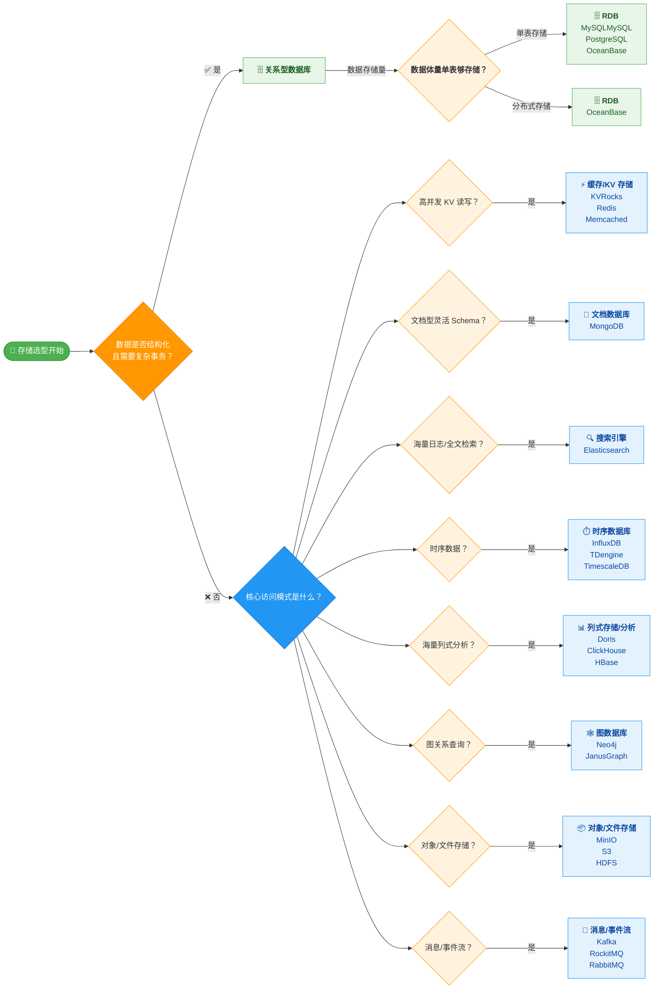

# 架构设计说明书 (ADD)

## 文档信息
| 属性     | 值             |
| -------- | -------------- |
| 版本     | 1.0 (逆向整理) |
| 更新日期 |                |

## 应用架构

### 系统架构

> 采用C4架构规范，绘制系统级C4架构，明确系统、子系统的职责、边界和集成关系

### 职责边界

> 系统的职责和边界说明

| 系统名称 | 主要职责      | 边界说明      |
| -------- | ------------- | ------------- |
| 系统A    | 系统A主要职责 | 系统A边界说明 |
| 系统B    | 系统B主要职责 | 系统B边界说明 |

## 技术架构

### 技术选型

> 采用C4架构规范，绘制容器级C4架构，明确技术容器及其协作关系

### 部署架构

> 采用mermaid协议图表达系统部署拓扑

## 工程架构

### 分层架构

> 采用mermaid协议图表达分层架构（MVC、DDD等），查明架构模式、代码组织、代码分层

### 领域模型

> 采用mermaid协议类图表达，明确对象关系，类仅包含类名，不包含属性和方法

### 组件架构

> 采用C4架构规范，绘制组件级C4架构，明确各模块及其的协作、依赖关系

### 核心组件

| **[组件名称]** | **职责** | **位置** | **依赖** | **被依赖** |
| -------------- | -------- | -------- | -------- | ---------- |
|                |          |          |          |            |

### API清单

| 端点 | 方法 | 描述 | 请求体 | 响应体 |
| ---- | ---- | ---- | ------ | ------ |
|      |      |      |        |        |

## 数据架构

### 数据库选型

### 核心表结构

> 采用UML规范的ER图和mermaid协议

### 数据流图

> 采用mermaid协议图表达

## 文档约定

- 优先采用C4和UML规范
- 优先采用mermaid协议