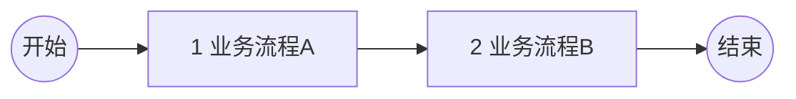
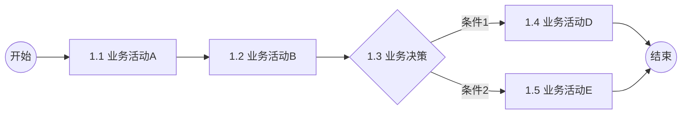
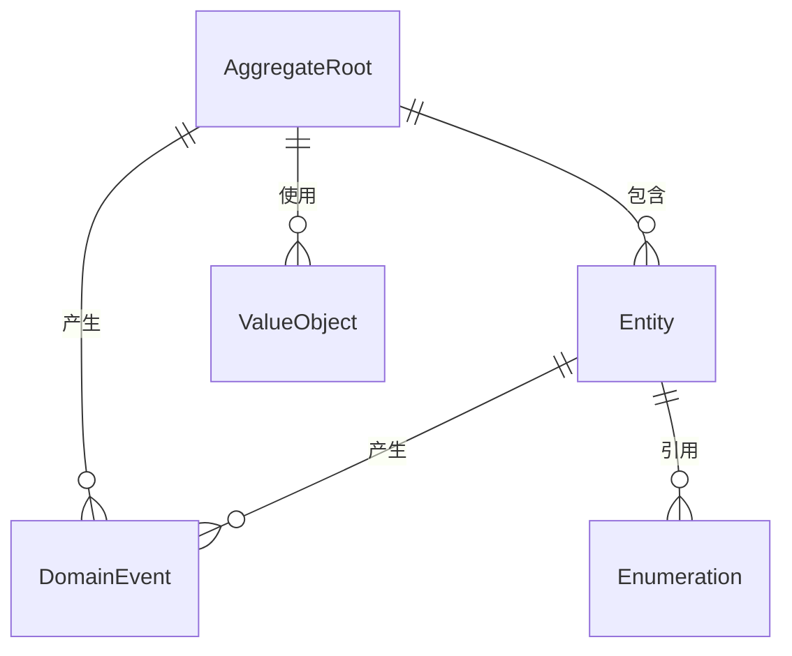
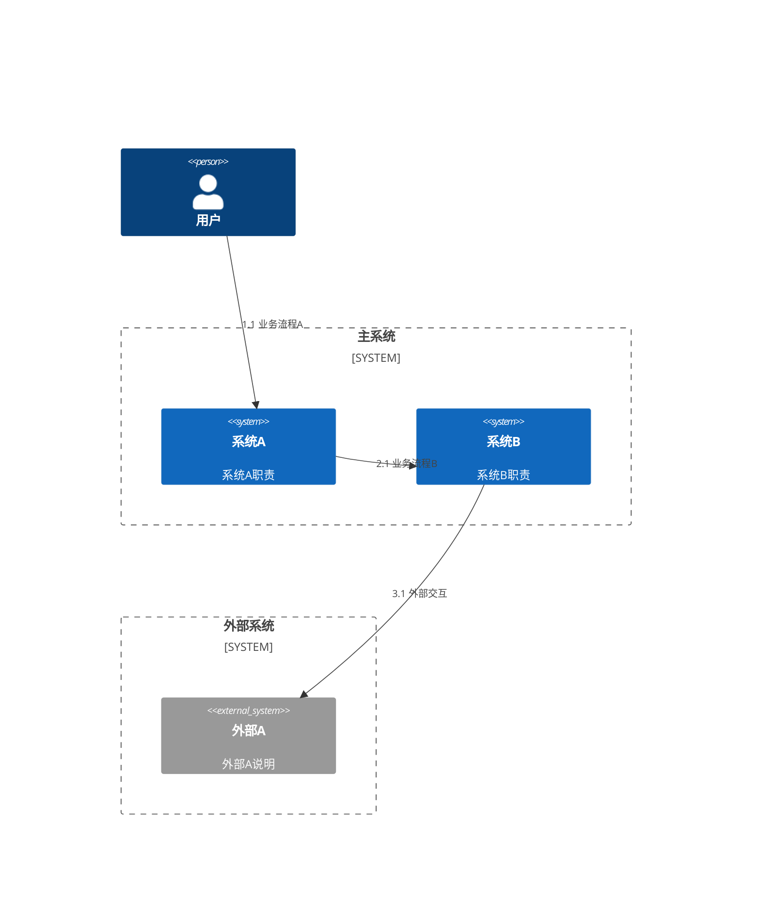

# 概要设计模板
> 基于DDD六边形架构的概要设计规范，覆盖业务分析、架构设计、质量属性等核心要素
> 遵从 @desin-guidelines.md 规范

## 一、业务分析

### 1. 名词定义
> 定义名词，介绍名词含义和案例

|名词|含义|举例|
|-----|-----|------|
| 名词1 | 名词含义，使用场景 | 名词案例 |

### 2. 业务流程
> 表达业务流转，使用mermaid流程图，体现全流程主要节点
> 主流程每个节点均为业务流程（a一位数字编码），子流程每个节点均为业务活动（a.b两位数字编码）

#### 主流程

|编码|业务流程|职责|输入|输出|
|-----|------|-------|-----|-----|
|1.1|业务流程A|描述该流程的业务职责|输入数据|输出数据|
|1.2|业务流程B|描述该流程的业务职责|输入数据|输出数据|

#### 子流程

|编码|业务活动|职责|输入|输出|
|-----|------|-------|-----|-----|
|1.1|业务活动A|描述该活动的业务职责|输入数据|输出数据|
|1.2|业务活动B|描述该活动的业务职责|输入数据|输出数据|

### 3. 领域模型
> 基于DDD设计领域模型，明确聚合根、实体、值对象及其关系
> 遵循统一语言，确保业务概念与技术实现一致

#### 领域对象
|领域对象|DDD类型|职责|关键属性|
|---|---|---|---|
|AggregateRoot|聚合根|维护业务一致性边界|ID、业务标识、状态、业务规则|
|Entity|实体|具有生命周期的业务对象|ID、名称、状态、关联聚合根|
|ValueObject|值对象|描述业务概念的无状态对象|属性组合、相等性判断|
|DomainEvent|领域事件|记录业务状态变化|事件类型、时间戳、业务数据|
|Enumeration|枚举|有限的业务状态集合|编码、名称、描述|

#### 对象关系

## 二、概要设计
### 1. 系统应用架构

#### 系统职责边界
> 界定系统的职责和边界

|系统名称|主要职责|边界说明|
|---|---|---|
|系统A|系统A主要职责|系统A边界说明|
|系统B|系统B主要职责|系统B边界说明|

### 3. 能力定义
> 定义每个业务活动对应的API能力，包括对应的两位数字编码（与业务流程保持一致）
> 明确能力的归属系统、功能说明（关键出入参）、SLA协议（TPS/QPS、TP95/99 RT）

|API能力（业务活动）|归属系统|能力说明|SLA协议|
|---|---|---|---|
|1.1 能力名称|所属系统|能力概述 入参：XX 出参：XX|TPS 200 TP95 RT 50ms TP99 RT 150ms|

### 4. 技术选型
|**VALET**| **考量维度** | **解决方案** | **解决措施** |
| --------------------------- | ------------------- | ------------ | ------------ |
| **Volume（容量）**：并发容量 | 流量（QPS/TPS）| 水平扩容 | 容器化，水平拓展 |
||| 限流削峰 | API限流，防雪崩 MQ削峰，离散流量 |
|| 数据量| 数据分区| 选择合适的存储介质 设计合理的存储结构 定义稳定的存储分片 减少存储时长，冷热分离 | 
|**Availability（可用性）**：1-错误率|可用率| MTBF / (MTBF + MTTR) | 提前预防，建设预案 监控报警，预先发现 故障响应，快速止损 故障处理，及时修复 | 
| **Latency（耗时）**：请求耗时 | 请求耗时（RT）| 优化运行性能 | 执行过程和算法优化 并发、异步执行 优化GC算法 |
||| 优化数据读写 | 批量写、缓冲写 数据索引，查询优化 数据缓存，异步加载 | 
|| IO耗时（RT） | 云/端缓存 | 从端到云到源缓存 资源压缩  连接池 | 
| **Error（错误率）**：鲁棒性| 安全性| 权限控制 | 登录验证 鉴权 越权 | 
| || 安全漏洞 | 攻击 窃取 篡改 泄露 | 
|| 容错性 | 参数容错 | 必要性验证 合法性验证 格式化验证 |
|| | 依赖容错 | 状态检查 无结果检查|
||| 异常容错 | 异常捕捉 日志记录 状态码转换 异常消息抛出 |
|| 一致性 | 数据一致性 | 本地事务 分布式事务 最终一致性 异步补偿|  
||| 业务幂等性| 幂等键 幂等状态 重试/恢复策略 |  
|| 稳定性 | 可观测性 | Logging Tracing  Metrics| 
||| 服务降级 | 快速超时 功能降级 服务熔断 | 
||| 容灾切换 | 多集群、网络部署 故障转移 灰度/蓝绿发布| 
| **Ticket（运维）**：工单 & 事件| 监控报警| 完善监控 | 多维系统监控 细分业务监控 | 
||| 告警处理 | 告警分级 告警治理  | 
||故障响应| 响应机制 | 报警跟进 故障处理 故障复盘 | 

## 三、详设文档
> 建议补充主流程与详细设计文档的映射表，便于追溯

| 主流程编号 | 主流程名称| 详细设计文档 |
|------------|--------------|-----------------------|
| 1| 业务流程A| 1 详细设计A.md |
| 2| 业务流程B| 2 详细设计B.md |
