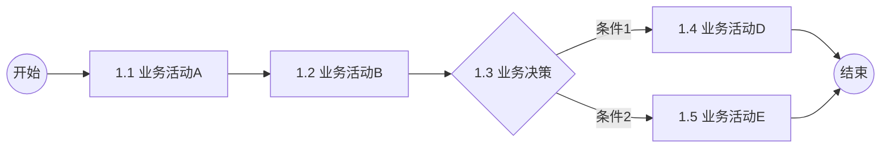
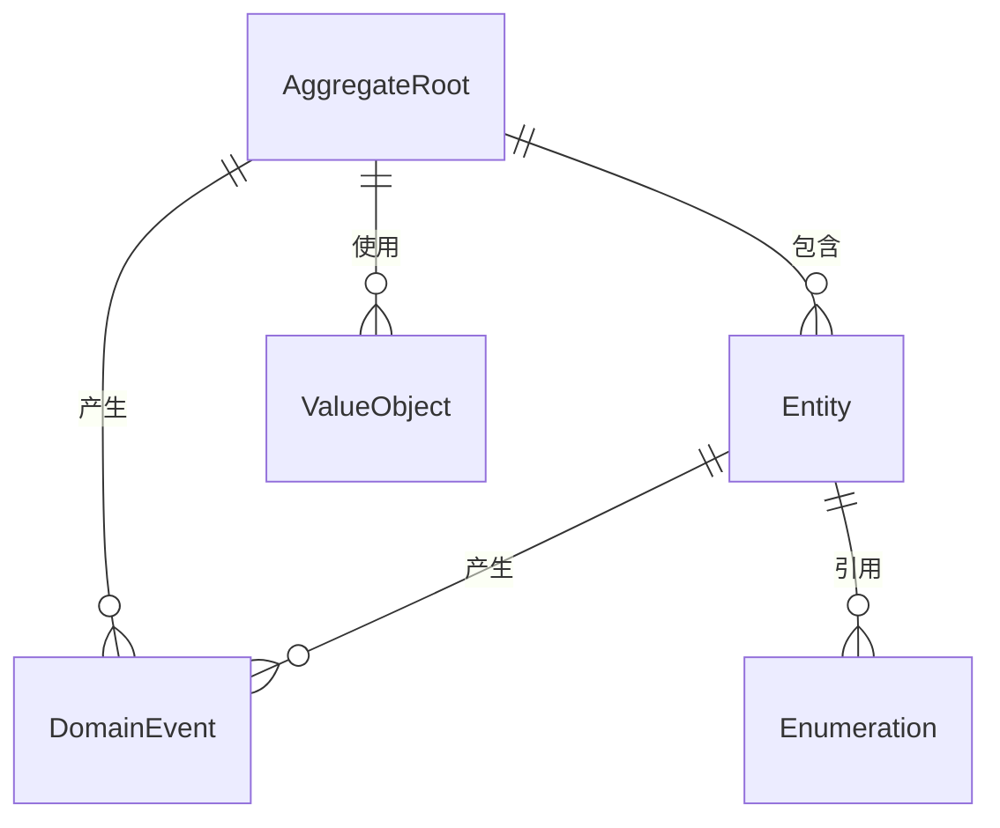
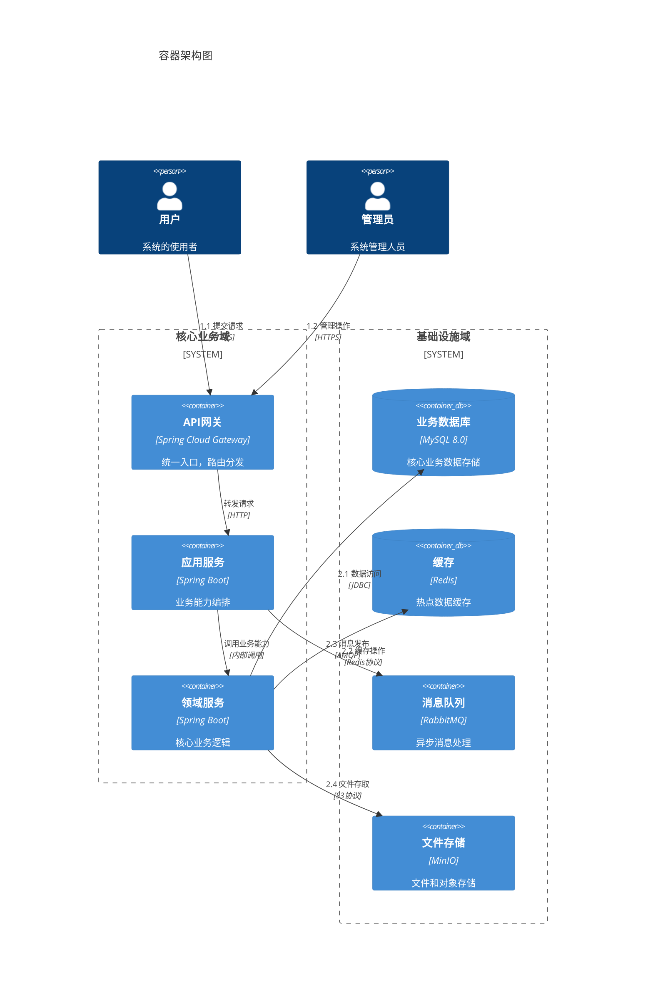
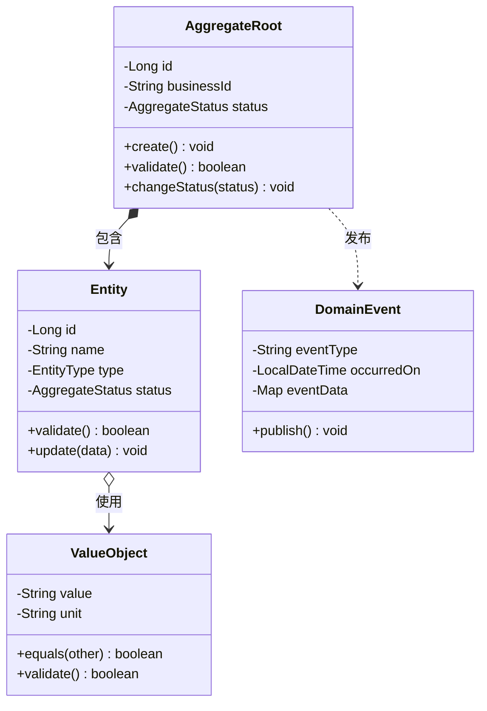
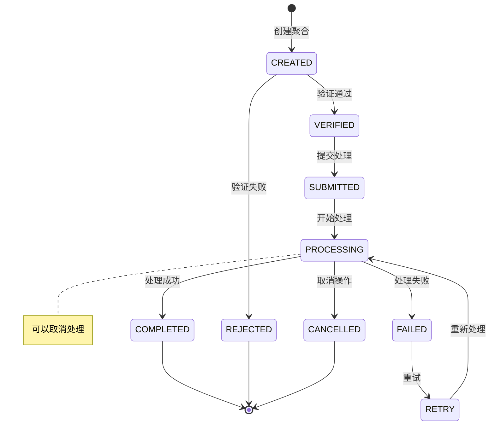
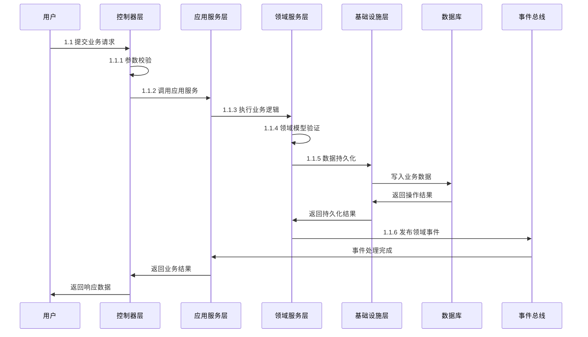
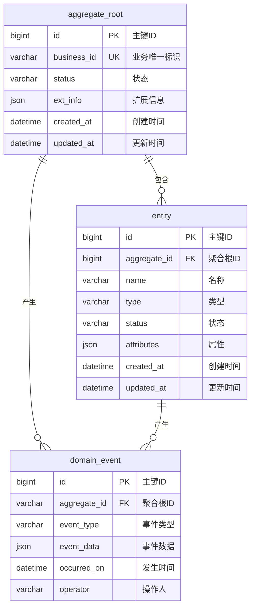

# 详细设计模板
> 基于DDD的详细设计规范，遵循统一语言和数字编码规范
> 遵从 @desin-guidelines.md 规范

## 一、业务分析

### 1. 名词定义
> 定义业务名词，建立统一语言，消除歧义

|名词|业务含义|技术映射|
|-----|-----|-----|
| 名词1 | 业务角度的定义和用途 | 对应的技术概念或实现 | 


### 2. 业务流程
> 使用限界上下文划分业务边界，每个流程节点对应应用服务
> 业务流程编码：a.b（两位数字），与API设计保持一致

#### 业务流程图


#### 流程说明
|编码|业务活动|职责|输入|输出|
|-----|--------|-----|-----|-----|
|1.1|业务活动A|描述该活动的业务职责|输入数据|输出数据|
|1.2|业务活动B|描述该活动的业务职责|输入数据|输出数据|


### 3. 领域模型
> 基于DDD设计领域模型，明确聚合根、实体、值对象及其关系
> 遵循统一语言，确保业务概念与技术实现一致

#### 领域对象
|领域对象|DDD类型|职责|关键属性|
|---|---|---|---|
|AggregateRoot|聚合根|维护业务一致性边界|ID、业务标识、状态、业务规则|
|Entity|实体|具有生命周期的业务对象|ID、名称、状态、关联聚合根|
|ValueObject|值对象|描述业务概念的无状态对象|属性组合、相等性判断|
|DomainEvent|领域事件|记录业务状态变化|事件类型、时间戳、业务数据|
|Enumeration|枚举|有限的业务状态集合|编码、名称、描述|

#### 对象关系


### 4. 能力定义
> 定义业务活动对应的应用服务能力，遵循六边形架构原则
> API能力与技术实现解耦，支持多种技术实现方式

|编码|API能力|归属系统&服务|能力描述|SLA要求|
|---|---|---|---|---|
|1.1|创建|所属系统|用户提交|TPS 100, TP99 RT 200ms|
|1.2|审核|所属系统|运营审核|TPS 50, TP99 RT 500ms|


## 二、详细设计
### 1. 应用架构
> 基于六边形架构设计，核心业务逻辑与技术实现解耦
> 使用C4模型描述系统架构，遵循整洁架构原则

#### 容器应用架构

#### 模块职责边界
|模块名称|主要职责|边界说明|
|---|---|---|
|模块A|模块A主要职责|模块A边界说明|
|模块B|模块B主要职责|模块B边界说明|

### 2. API设计
> 基于六边形架构设计API，业务核心与技术实现解耦
> 支持多种协议（REST/Dubbo/gRPC），保持业务能力一致性

#### API规范表
|API属性|规范要求|示例|
|-----|-----|-----|
|接口名称|{业务活动} + {操作类型}|创建、查询列表|
|资源路径|com.{company}.{business}.{context}.api.{Aggregate}Service|com.alibaba.tmall.goods.manage.api.GoodsManageService|
|请求参数|符合RESTful规范，支持分页、过滤、排序|{\"page\":1,\"size\":10}| 
|响应格式|统一响应封装，包含success、code、message、module|{\"success\":true,\"code\":200,\"message\":\"OK\",\"module\":{}}|
|错误处理|标准HTTP状态码 + 业务错误message|400(参数错误)、404(资源不存在)、500(系统错误)|
|幂等性|关键操作支持幂等，提供幂等键|Idempotency-Key: uuid|

#### API与业务能力映射
|编号|API能力|API签名|任务|
|-----|-----|-----|-----|
|1.1|创建|方法：com.{company}.{business}.{context}.api.{Aggregate}Service.create<br/>参数：{ }<br/>结果：{"success":true,"code":200,"message":"OK","module":{}}|1.1.1 验证申诉数据<br/>1.1.2 保存申诉信息<br/>1.1.3 发布领域事件|支持|TP99 < 200ms|

### 3. 逻辑模型
> 基于DDD设计逻辑模型，体现业务核心与技术实现的分离
> 使用mermaid协议的UML图表描述类结构、状态流转和处理时序

#### 领域类图设计


#### 状态机设计


#### 分层处理时序


### 4. 数据模型
> 基于领域模型设计数据模型，保持业务概念与数据结构一致
> 遵循数据库设计规范，支持业务一致性和性能要求

#### ER关系图


#### 表结构设计规范
```sql
-- 聚合根表设计
CREATE TABLE `aggregate_root` (
    `id` bigint NOT NULL AUTO_INCREMENT COMMENT '主键ID',
    `business_id` varchar(64) NOT NULL COMMENT '业务唯一标识',
    `status` varchar(32) NOT NULL COMMENT '状态',
    `ext_info` json DEFAULT NULL COMMENT '扩展信息',
    `created_at` datetime NOT NULL DEFAULT CURRENT_TIMESTAMP COMMENT '创建时间',
    `updated_at` datetime NOT NULL DEFAULT CURRENT_TIMESTAMP ON UPDATE CURRENT_TIMESTAMP COMMENT '更新时间',
    `version` int NOT NULL DEFAULT 1 COMMENT '乐观锁版本号',
    PRIMARY KEY (`id`),
    UNIQUE KEY `uk_business_id` (`business_id`),
    KEY `idx_status` (`status`),
    KEY `idx_created_at` (`created_at`)
) ENGINE=InnoDB DEFAULT CHARSET=utf8mb4 COMMENT='聚合根表';

-- 实体表设计  
CREATE TABLE `entity` (
    `id` bigint NOT NULL AUTO_INCREMENT COMMENT '主键ID',
    `aggregate_id` bigint NOT NULL COMMENT '聚合根ID',
    `name` varchar(128) NOT NULL COMMENT '名称',
    `type` varchar(32) NOT NULL COMMENT '类型',
    `status` varchar(32) NOT NULL COMMENT '状态',
    `attributes` json DEFAULT NULL COMMENT '属性',
    `created_at` datetime NOT NULL DEFAULT CURRENT_TIMESTAMP COMMENT '创建时间',
    `updated_at` datetime NOT NULL DEFAULT CURRENT_TIMESTAMP ON UPDATE CURRENT_TIMESTAMP COMMENT '更新时间',
    PRIMARY KEY (`id`),
    KEY `idx_aggregate_id` (`aggregate_id`),
    KEY `idx_type_status` (`type`, `status`)
) ENGINE=InnoDB DEFAULT CHARSET=utf8mb4 COMMENT='实体表';

-- 领域事件表设计
CREATE TABLE `domain_event` (
    `id` bigint NOT NULL AUTO_INCREMENT COMMENT '主键ID',
    `aggregate_id` varchar(64) NOT NULL COMMENT '聚合根业务ID',
    `event_type` varchar(64) NOT NULL COMMENT '事件类型',
    `event_data` json NOT NULL COMMENT '事件数据',
    `occurred_on` datetime NOT NULL DEFAULT CURRENT_TIMESTAMP COMMENT '发生时间',
    `operator` varchar(64) DEFAULT NULL COMMENT '操作人',
    PRIMARY KEY (`id`),
    KEY `idx_aggregate_id` (`aggregate_id`),
    KEY `idx_event_type` (`event_type`),
    KEY `idx_occurred_on` (`occurred_on`)
) ENGINE=InnoDB DEFAULT CHARSET=utf8mb4 COMMENT='领域事件表';
```
