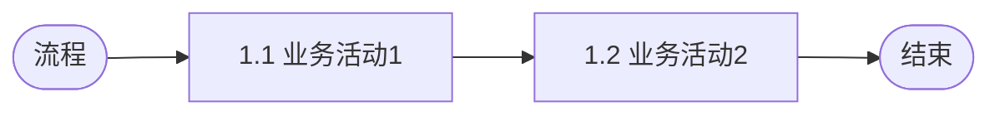
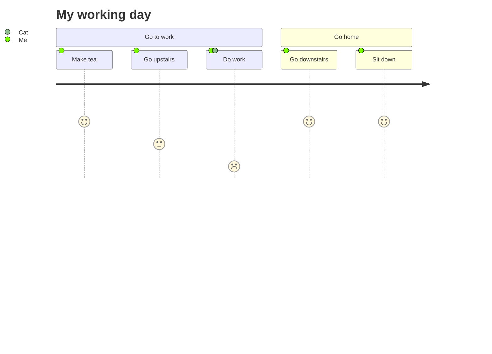

# 需求文档规范

> 文档约束
> 原则：产品说明书，而非需求说明文档
> 组织形式：遵从产品/模块/菜单/功能/操作组织形式
> 可回溯产品版本变更历史细节，版本变动均带版本号
> 改动内容统一用斜体字标出，前版本内容删除用删除线+斜体字
> 表达模式：SCQA

# 版本记录

| **版本号** | **修订时间** | **修订人**    | **内容概述**   | 
| -------- | ----------- | ------- | ------------------ | 
| V1.0.0     | 2025-2-10    | @XXX | N 新建XXX A 增加XXX M 更改XXX D 删除 |

# 1、背景目标
## 背景
> *背景：解释为什么要做这个需求、解决什么问题？（例：提升用户留存率、填补市场空白、优化用户体验痛点）*

### 业务场景
> *详细描述用户使用产品的具体场景、情境、环境条件、遇到什么问题*

| **时间（When）**   | 什么情况下，什么时间点 |
| ------------------ | ---------------------- |
| **地点（Where）**  | 在什么地方             |
| **人物（Who）**    | 谁（用户角色）         |
| **原因（Why）**    | 因为什么原因           |
| **做什么（What）** | 要做什么               |

### 目标用户
> *用户画像：目标用户特征描述：年龄、职业、业务熟练度、使用习惯、痛点需求等*

| **用户角色** | **用户规模** | **使用频率** | **痛点诉求** |
| ------------ | ------------ | ------------ | ------------ |
|              |              |              |              |

## 目标
> *目标：一句话概括整体需求，包含产品核心价值和解决的核心问题，用可量化的指标定义成功标准（如 DAU 提升 20%），满足SMART原则*

O：达成什么样的效果
- KR：关键结果，可衡量指标1
- KR：关键结果，可衡量指标2

# 2、产品方案
> *方案：帮助用户解决他问题的思路和路径*

## 产品架构
> *描述各产品功能和模块的职责边界和协作方式*

| **产品** | **模块** | **职责边界**  |
| ------------ | ---------- |------------ |
| 产品A  | 模块M1 | 1：支持XXX 4：支持XXX |            
| 产品A  | 模块M2 | 2：支持XXX |
| 产品B  | 模块M3 | 3：支持XXX |

## 流程设计
> *业务流程设计，描述用户在完整旅程中各个阶段使用的产品功能*

# 3、产品交互
## 用户旅程
> *端到端的完整旅程，从用户起始需求到完整目标达成的分阶段、分步骤描述*

## 交互原型
> *填入交互图链接或贴UI交互图*

产品原型图：这里贴原型链接

# 4、功能需求

## 功能清单
> *详细列出功能清单，按模块分类，包含核心功能和支撑功能*

| **模块** | **功能** | **使用场景**   | **前提条件** | **处理规则** | **后置处理** |
| ------------ | ---------- | -------------- | ------------ | -------------------------------------------- | ------------ |
| **模块M** |  功能F |  使用场景| 前置条件1| 处理规则 | 后置处理 |

## **XX模块**

### **功能原型**

### **用例说明**

**XX用例**

| **描述项** | **描述内容** |
| ----------- |--------------------- |
| **角色** | 角色R | 
| **用例** | 用例U | 
| **发生位置** |菜单1/功能F/操作点O | 
| **核心操作** |核心操作描述 | 
| **触发条件** |触发条件1、2| 
| **前置条件** |前置条件：1、2、3 | 
| **后置处理** |后置处理：1、2、3 | 

# **5、非功能需求**
> *权限、性能、安全、兼容性等非功能需求描述*

## 用户权限

| **用户角色** | **功能项** | **用户权限**               | **数据范围** |
| ------------ | ---------- | ------------ | ------------ |
| 角色A  | 功能F | 权限P | XX范围   |

## 技术需求
| **功能类型** | **范围（菜单/功能/操作）** | **功能点描述**                                               |
| ------------ | ---------------- | --------------------- |
| 性能         | |  |
| 安全         | |  |
| 兼容性       | | |
| 埋点         | |  |

# 6、参考文档